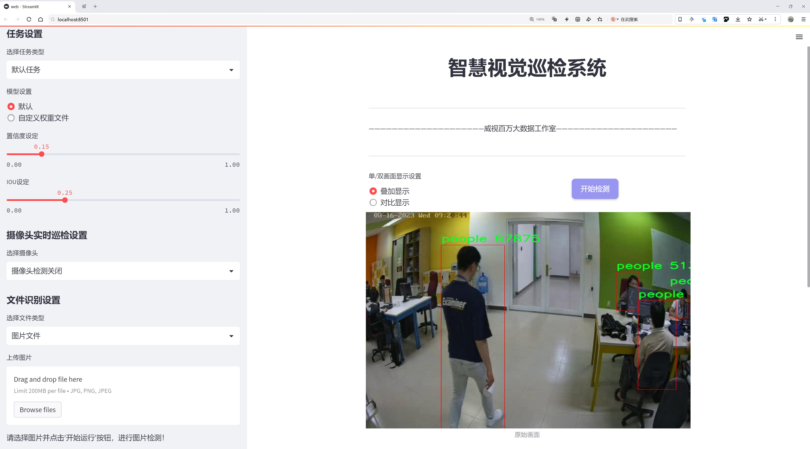
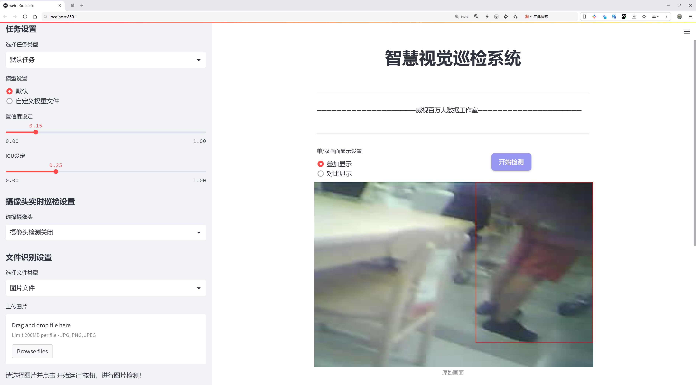
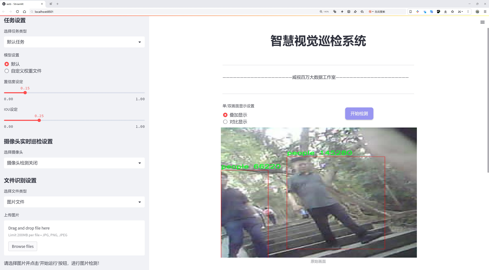
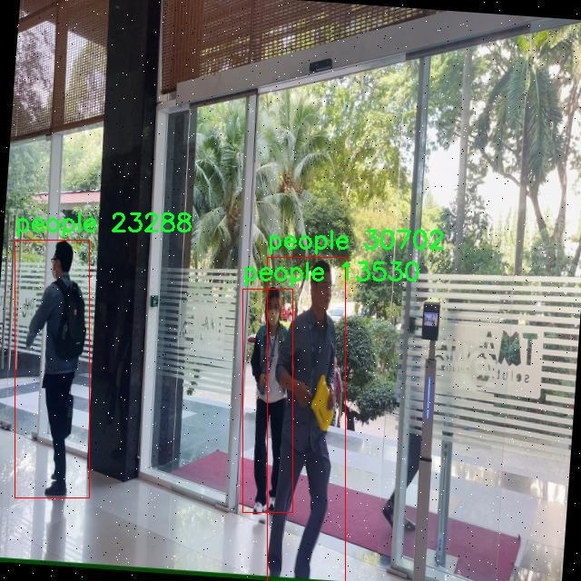
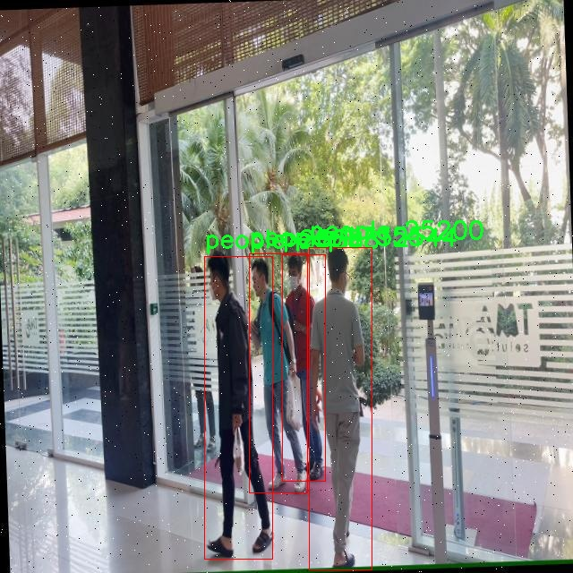
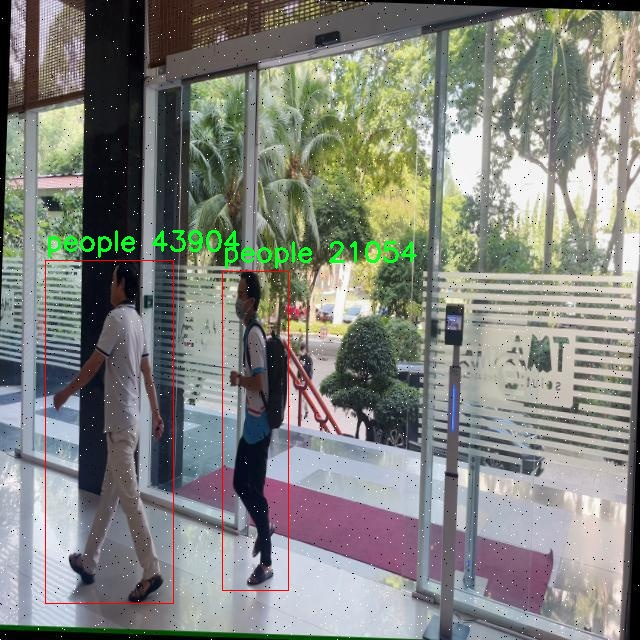
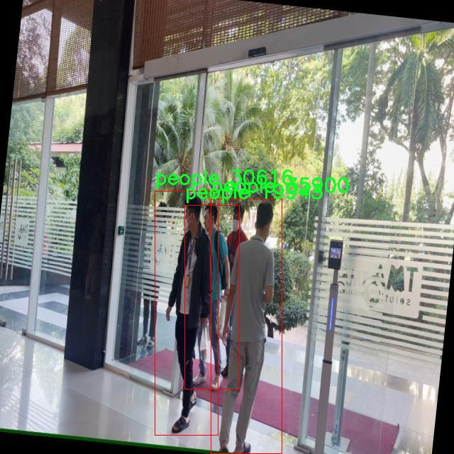
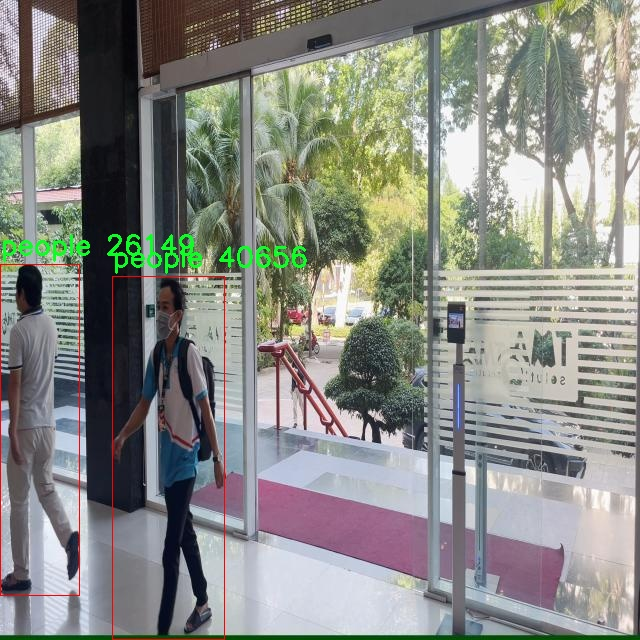

# 行人2检测检测系统源码分享
 # [一条龙教学YOLOV8标注好的数据集一键训练_70+全套改进创新点发刊_Web前端展示]

### 1.研究背景与意义

项目参考[AAAI Association for the Advancement of Artificial Intelligence](https://gitee.com/qunshansj/projects)

项目来源[AACV Association for the Advancement of Computer Vision](https://gitee.com/qunmasj/projects)

研究背景与意义

随着城市化进程的加快和智能监控技术的迅猛发展，行人检测在智能交通、公共安全和人机交互等领域的重要性日益凸显。行人检测技术不仅能够有效提升交通管理的智能化水平，还能在公共安全监控中发挥关键作用，及时识别潜在的安全隐患。因此，开发高效、准确的行人检测系统成为了计算机视觉领域的一个重要研究方向。

近年来，深度学习技术的快速发展为目标检测任务带来了革命性的变化。其中，YOLO（You Only Look Once）系列模型因其高效的实时检测能力和较高的准确率而受到广泛关注。YOLOv8作为该系列的最新版本，结合了更先进的网络结构和优化算法，能够在复杂环境中实现快速而准确的目标检测。然而，尽管YOLOv8在多个数据集上表现出色，但在特定场景下，如拥挤的城市街道或多变的光照条件下，其检测性能仍有待提升。因此，基于改进YOLOv8的行人检测系统的研究显得尤为重要。

本研究将利用一个包含3100张图像的行人检测数据集，针对该数据集的特性进行YOLOv8模型的改进。该数据集专注于行人这一单一类别，提供了丰富的样本，能够有效支持模型的训练和验证。通过对数据集的深入分析，我们可以发现行人在不同场景下的外观变化、姿态多样性以及遮挡情况等因素，这些都对行人检测的准确性提出了挑战。因此，针对这些特征进行模型的优化，将是提升行人检测系统性能的关键。

本研究的意义不仅在于技术层面的创新，更在于其广泛的应用前景。随着智能城市建设的推进，行人检测技术将为交通管理、公共安全监控、智能导航等领域提供重要支持。通过提升行人检测的准确性和实时性，我们可以有效减少交通事故、提升公共安全，并为智能交通系统的构建奠定基础。此外，改进YOLOv8的行人检测系统还将为相关研究提供新的思路和方法，推动计算机视觉领域的进一步发展。

综上所述，基于改进YOLOv8的行人检测系统的研究不仅具有重要的理论价值，也具备广泛的实际应用意义。通过深入探讨和解决行人检测中的关键问题，我们期望能够为未来的智能监控和交通管理系统提供更为高效、可靠的技术支持，从而推动社会的安全与和谐发展。

### 2.图片演示







##### 注意：由于此博客编辑较早，上面“2.图片演示”和“3.视频演示”展示的系统图片或者视频可能为老版本，新版本在老版本的基础上升级如下：（实际效果以升级的新版本为准）

  （1）适配了YOLOV8的“目标检测”模型和“实例分割”模型，通过加载相应的权重（.pt）文件即可自适应加载模型。

  （2）支持“图片识别”、“视频识别”、“摄像头实时识别”三种识别模式。

  （3）支持“图片识别”、“视频识别”、“摄像头实时识别”三种识别结果保存导出，解决手动导出（容易卡顿出现爆内存）存在的问题，识别完自动保存结果并导出到tempDir中。

  （4）支持Web前端系统中的标题、背景图等自定义修改，后面提供修改教程。

  另外本项目提供训练的数据集和训练教程,暂不提供权重文件（best.pt）,需要您按照教程进行训练后实现图片演示和Web前端界面演示的效果。

### 3.视频演示

[3.1 视频演示](https://www.bilibili.com/video/BV165tAeME9R/)

### 4.数据集信息展示

##### 4.1 本项目数据集详细数据（类别数＆类别名）

nc: 1
names: ['people']


##### 4.2 本项目数据集信息介绍

数据集信息展示

在本研究中，我们采用了名为“detect_people”的数据集，以改进YOLOv8的行人检测系统。该数据集专注于行人检测任务，提供了丰富的标注数据，旨在提升计算机视觉模型在复杂环境中对行人的识别能力。数据集的类别数量为1，唯一的类别为“people”，这表明数据集的设计是高度专注的，旨在通过专一的目标检测来优化模型的性能。

“detect_people”数据集包含了多样化的行人图像，涵盖了不同的场景、姿态、光照条件以及背景复杂度。这种多样性使得模型在训练过程中能够学习到更为丰富的特征，从而在实际应用中具备更强的泛化能力。数据集中行人的姿态变化、遮挡情况以及与其他物体的交互都被充分考虑，确保了模型在真实世界中的应用效果。

在数据集的构建过程中，图像的选择和标注都经过严格的审核，以确保数据的质量和准确性。每一张图像都经过专业标注人员的精心标注，确保行人的边界框准确无误。这种高质量的标注不仅提升了模型的训练效果，也为后续的模型评估提供了可靠的基准。数据集中的图像涵盖了不同的城市环境、公共场所以及各种天气条件，极大地增强了模型的鲁棒性。

为了更好地利用“detect_people”数据集进行YOLOv8的训练，我们在数据预处理阶段进行了多项操作，包括图像缩放、裁剪、翻转以及颜色增强等。这些操作不仅增加了数据集的多样性，还有效地提高了模型的训练效率。通过这些预处理步骤，模型能够在不同的输入条件下保持较高的检测精度。

在模型训练过程中，我们将“detect_people”数据集划分为训练集和验证集，以便于对模型的性能进行评估。训练集用于模型的学习，而验证集则用于监测模型在未见数据上的表现。这种划分策略确保了模型在训练过程中不会过拟合，从而提高了其在实际应用中的可靠性。

此外，我们还对数据集进行了数据增强，以进一步提升模型的性能。通过引入随机旋转、缩放、亮度调整等技术，我们能够生成更多的训练样本，使得模型在面对不同场景时具备更强的适应能力。这种增强策略不仅丰富了数据集的多样性，也为模型提供了更为全面的训练基础。

总之，“detect_people”数据集为改进YOLOv8的行人检测系统提供了坚实的基础。通过高质量的标注、多样化的图像内容以及有效的数据处理策略，我们期望能够显著提升模型在行人检测任务中的表现，使其在实际应用中能够更好地应对各种复杂场景。这一数据集的应用不仅推动了行人检测技术的发展，也为相关领域的研究提供了宝贵的资源。











### 5.全套项目环境部署视频教程（零基础手把手教学）

[5.1 环境部署教程链接（零基础手把手教学）](https://www.ixigua.com/7404473917358506534?logTag=c807d0cbc21c0ef59de5)


[5.2 安装Python虚拟环境创建和依赖库安装视频教程链接（零基础手把手教学）](https://www.ixigua.com/7404474678003106304?logTag=1f1041108cd1f708b01a)

### 6.手把手YOLOV8训练视频教程（零基础小白有手就能学会）

[6.1 手把手YOLOV8训练视频教程（零基础小白有手就能学会）](https://www.ixigua.com/7404477157818401292?logTag=d31a2dfd1983c9668658)

### 7.70+种全套YOLOV8创新点代码加载调参视频教程（一键加载写好的改进模型的配置文件）

[7.1 70+种全套YOLOV8创新点代码加载调参视频教程（一键加载写好的改进模型的配置文件）](https://www.ixigua.com/7404478314661806627?logTag=29066f8288e3f4eea3a4)

### 8.70+种全套YOLOV8创新点原理讲解（非科班也可以轻松写刊发刊，V10版本正在科研待更新）

由于篇幅限制，每个创新点的具体原理讲解就不一一展开，具体见下列网址中的创新点对应子项目的技术原理博客网址【Blog】：


[8.1 70+种全套YOLOV8创新点原理讲解链接](https://gitee.com/qunmasj/good)

### 9.系统功能展示（检测对象为举例，实际内容以本项目数据集为准）

图9.1.系统支持检测结果表格显示

  图9.2.系统支持置信度和IOU阈值手动调节

  图9.3.系统支持自定义加载权重文件best.pt(需要你通过步骤5中训练获得)

  图9.4.系统支持摄像头实时识别

  图9.5.系统支持图片识别

  图9.6.系统支持视频识别

  图9.7.系统支持识别结果文件自动保存

  图9.8.系统支持Excel导出检测结果数据


### 10.原始YOLOV8算法原理

原始YOLOv8算法原理

YOLOv8算法作为YOLO系列的最新成员，延续了其前辈的设计理念，同时在多个方面进行了创新和改进。该算法的整体架构依然遵循输入层、主干网络、特征融合层和解耦头的设计框架，然而其在每个组件的实现上都融入了新的思路和技术，使得YOLOv8在目标检测的性能上达到了新的高度。

在主干网络方面，YOLOv8继续采用YOLOv5的CSPDarknet架构，但对其进行了重要的改进。具体而言，YOLOv8将YOLOv5中的C3模块替换为C2f模块。C2f模块的设计灵感来源于YOLOv7的ELAN结构，它通过引入更多的残差连接，显著增强了模型的梯度流动性。这种设计不仅提升了特征提取的效率，还在保持模型轻量化的同时，确保了检测精度的提升。C2f模块的结构包含多个CBS（卷积+归一化+SiLU激活函数）块，以及一系列的Bottleneck层，通过这样的设计，C2f模块能够有效地捕捉到更丰富的特征信息，并在不同层次之间实现更好的特征重用。

YOLOv8的特征融合层采用了PAN-FPN结构，旨在充分整合不同尺度的特征信息。在这一结构中，YOLOv8去除了YOLOv5中上采样阶段的1x1卷积操作，使得高层特征能够直接与中层特征进行融合。这种自下而上的特征融合方式，不仅提高了特征的表达能力，还增强了模型对细节信息的捕捉能力。通过这样的设计，YOLOv8能够更好地处理复杂场景中的目标检测任务，尤其是在面对多尺度物体时，表现得尤为出色。

值得注意的是，YOLOv8在目标检测的方式上进行了重大转变，抛弃了传统的Anchor-Based方法，转而采用Anchor-Free的思想。这一变化使得模型在处理目标时更加灵活，能够更好地适应不同尺寸和形状的物体。通过引入Task-Aligned的样本匹配策略，YOLOv8能够在训练过程中更有效地进行样本分配，从而提升了模型的训练效率和检测精度。

在损失函数的设计上，YOLOv8也做出了创新。它采用了VFLLoss作为分类损失，并结合DFLLoss和CIoULoss作为回归损失。这种组合不仅提高了模型对难以分类样本的处理能力，还有效地解决了样本不平衡的问题。通过这样的损失函数设计，YOLOv8能够在训练过程中更好地聚焦于难以识别的目标，从而提升整体的检测性能。

在数据预处理方面，YOLOv8沿用了YOLOv5的策略，采用了多种数据增强手段，如马赛克增强、混合增强、空间扰动和颜色扰动等。这些增强技术的应用，使得模型在训练过程中能够接触到更为多样化的样本，从而提高了模型的泛化能力和鲁棒性。

YOLOv8的解耦头结构是其另一大亮点。该结构将分类和回归任务分离，使得模型在进行目标检测时能够更为高效地处理不同的任务。解耦头通过多个并行的卷积分支，分别计算目标的类别和边框回归损失，这种设计使得模型在进行目标检测时，能够更好地平衡分类和回归的性能。

综上所述，YOLOv8算法在多个方面进行了创新和改进，从主干网络的C2f模块到特征融合的PAN-FPN结构，再到Anchor-Free的检测方式和解耦头的设计，所有这些都使得YOLOv8在目标检测领域展现出了强大的能力。通过不断优化和调整，YOLOv8不仅提升了检测精度，也增强了模型的适应性和灵活性，为实际应用提供了更为可靠的解决方案。随着YOLOv8的推出，目标检测技术又向前迈进了一大步，未来在更多复杂场景中的应用将更加广泛和深入。


### 11.项目核心源码讲解（再也不用担心看不懂代码逻辑）

#### 11.1 ui.py

以下是经过精简和注释的核心代码部分：

```python
import sys
import subprocess
from QtFusion.path import abs_path

def run_script(script_path):
    """
    使用当前 Python 环境运行指定的脚本。

    Args:
        script_path (str): 要运行的脚本路径
    """
    # 获取当前 Python 解释器的路径
    python_path = sys.executable

    # 构建运行命令，使用 streamlit 运行指定的脚本
    command = f'"{python_path}" -m streamlit run "{script_path}"'

    # 执行命令，并等待其完成
    result = subprocess.run(command, shell=True)
    
    # 检查命令执行结果，如果返回码不为0，则表示出错
    if result.returncode != 0:
        print("脚本运行出错。")

# 主程序入口
if __name__ == "__main__":
    # 获取要运行的脚本的绝对路径
    script_path = abs_path("web.py")

    # 调用函数运行指定的脚本
    run_script(script_path)
```

### 代码分析与注释：
1. **导入模块**：
   - `sys`：用于访问与 Python 解释器相关的变量和函数。
   - `subprocess`：用于执行外部命令。
   - `abs_path`：从 `QtFusion.path` 模块导入的函数，用于获取文件的绝对路径。

2. **`run_script` 函数**：
   - 功能：接受一个脚本路径作为参数，并在当前 Python 环境中运行该脚本。
   - 参数：
     - `script_path`：要运行的脚本的路径。
   - 实现步骤：
     - 获取当前 Python 解释器的路径。
     - 构建运行命令，使用 `streamlit` 模块来运行指定的脚本。
     - 使用 `subprocess.run` 执行命令，并等待其完成。
     - 检查命令的返回码，如果不为0，表示脚本运行出错，打印错误信息。

3. **主程序入口**：
   - 使用 `if __name__ == "__main__":` 确保只有在直接运行该脚本时才会执行以下代码。
   - 获取要运行的脚本的绝对路径（`web.py`）。
   - 调用 `run_script` 函数来运行该脚本。 

这个代码的核心功能是通过 `streamlit` 在当前 Python 环境中运行指定的脚本，并处理可能的错误。

这个文件名为 `ui.py`，其主要功能是运行一个指定的 Python 脚本，具体是通过 Streamlit 框架来启动一个 Web 应用。文件中首先导入了必要的模块，包括 `sys`、`os` 和 `subprocess`，以及一个自定义的 `abs_path` 函数，用于获取脚本的绝对路径。

在 `run_script` 函数中，首先获取当前 Python 解释器的路径，这样可以确保在正确的环境中运行脚本。接着，构建一个命令字符串，该命令使用当前的 Python 解释器来运行指定的脚本，具体是通过 `streamlit run` 命令来启动。然后，使用 `subprocess.run` 方法执行这个命令，并通过 `shell=True` 参数允许在 shell 中执行命令。

在执行命令后，函数会检查返回的状态码。如果状态码不为零，表示脚本运行过程中出现了错误，此时会打印出“脚本运行出错”的提示信息。

在文件的最后部分，使用 `if __name__ == "__main__":` 语句来确保只有在直接运行该脚本时才会执行后面的代码。这里指定了要运行的脚本路径为 `web.py`，并调用 `run_script` 函数来启动这个脚本。

总体来说，这个文件的功能是提供一个简单的接口来运行一个 Streamlit 应用，确保在正确的 Python 环境中执行，并处理可能出现的错误。

#### 11.2 70+种YOLOv8算法改进源码大全和调试加载训练教程（非必要）\ultralytics\nn\backbone\CSwomTramsformer.py

以下是代码中最核心的部分，并附上详细的中文注释：

```python
import torch
import torch.nn as nn
import numpy as np

class Mlp(nn.Module):
    """多层感知机（MLP）模块"""
    def __init__(self, in_features, hidden_features=None, out_features=None, act_layer=nn.GELU, drop=0.):
        super().__init__()
        out_features = out_features or in_features  # 输出特征数默认为输入特征数
        hidden_features = hidden_features or in_features  # 隐藏层特征数默认为输入特征数
        self.fc1 = nn.Linear(in_features, hidden_features)  # 第一层全连接
        self.act = act_layer()  # 激活函数
        self.fc2 = nn.Linear(hidden_features, out_features)  # 第二层全连接
        self.drop = nn.Dropout(drop)  # Dropout层

    def forward(self, x):
        """前向传播"""
        x = self.fc1(x)  # 通过第一层
        x = self.act(x)  # 激活
        x = self.drop(x)  # Dropout
        x = self.fc2(x)  # 通过第二层
        x = self.drop(x)  # Dropout
        return x

class LePEAttention(nn.Module):
    """带有位置编码的注意力机制"""
    def __init__(self, dim, resolution, idx, split_size=7, num_heads=8, attn_drop=0.):
        super().__init__()
        self.dim = dim  # 输入特征维度
        self.resolution = resolution  # 输入分辨率
        self.split_size = split_size  # 分割大小
        self.num_heads = num_heads  # 注意力头数
        head_dim = dim // num_heads  # 每个头的维度
        self.scale = head_dim ** -0.5  # 缩放因子
        self.get_v = nn.Conv2d(dim, dim, kernel_size=3, stride=1, padding=1, groups=dim)  # 卷积层用于获取位置编码
        self.attn_drop = nn.Dropout(attn_drop)  # 注意力Dropout

    def im2cswin(self, x):
        """将输入转换为窗口格式"""
        B, N, C = x.shape  # B: 批量大小, N: 序列长度, C: 特征维度
        H = W = int(np.sqrt(N))  # 计算高度和宽度
        x = x.transpose(-2, -1).contiguous().view(B, C, H, W)  # 转换为图像格式
        x = img2windows(x, self.split_size, self.split_size)  # 切分为窗口
        return x

    def forward(self, qkv):
        """前向传播"""
        q, k, v = qkv  # 获取查询、键、值
        q = self.im2cswin(q)  # 将查询转换为窗口格式
        k = self.im2cswin(k)  # 将键转换为窗口格式
        v = self.get_v(v)  # 获取位置编码
        attn = (q @ k.transpose(-2, -1)) * self.scale  # 计算注意力
        attn = nn.functional.softmax(attn, dim=-1)  # 归一化
        attn = self.attn_drop(attn)  # 应用Dropout
        x = attn @ v  # 计算加权值
        return x

class CSWinBlock(nn.Module):
    """CSWin Transformer的基本块"""
    def __init__(self, dim, num_heads, split_size=7, mlp_ratio=4.):
        super().__init__()
        self.qkv = nn.Linear(dim, dim * 3)  # 线性层用于生成查询、键、值
        self.attn = LePEAttention(dim, resolution=split_size, idx=0, num_heads=num_heads)  # 注意力层
        self.mlp = Mlp(in_features=dim, hidden_features=int(dim * mlp_ratio), out_features=dim)  # MLP层

    def forward(self, x):
        """前向传播"""
        qkv = self.qkv(x).reshape(x.shape[0], -1, 3, x.shape[2]).permute(2, 0, 1, 3)  # 生成qkv
        x = self.attn(qkv)  # 通过注意力层
        x = x + self.mlp(x)  # 通过MLP层
        return x

class CSWinTransformer(nn.Module):
    """CSWin Transformer模型"""
    def __init__(self, img_size=640, num_classes=1000, embed_dim=96, depth=[2, 2, 6, 2]):
        super().__init__()
        self.num_classes = num_classes
        self.embed_dim = embed_dim
        self.stage1 = nn.ModuleList([CSWinBlock(embed_dim, num_heads=12) for _ in range(depth[0])])  # 第一阶段
        self.stage2 = nn.ModuleList([CSWinBlock(embed_dim * 2, num_heads=24) for _ in range(depth[1])])  # 第二阶段
        self.stage3 = nn.ModuleList([CSWinBlock(embed_dim * 4, num_heads=48) for _ in range(depth[2])])  # 第三阶段
        self.stage4 = nn.ModuleList([CSWinBlock(embed_dim * 8, num_heads=96) for _ in range(depth[3])])  # 第四阶段

    def forward(self, x):
        """前向传播"""
        for stage in [self.stage1, self.stage2, self.stage3, self.stage4]:
            for blk in stage:
                x = blk(x)  # 通过每个块
        return x

# 示例代码
if __name__ == '__main__':
    inputs = torch.randn((1, 3, 640, 640))  # 输入示例
    model = CSWinTransformer()  # 创建模型
    res = model(inputs)  # 前向传播
    print(res.size())  # 输出结果的尺寸
```

### 代码核心部分解释：
1. **Mlp类**：实现了一个简单的多层感知机，包括两层全连接层和激活函数。
2. **LePEAttention类**：实现了带有位置编码的注意力机制，负责将输入的查询、键、值转换为窗口格式并计算注意力。
3. **CSWinBlock类**：构建了CSWin Transformer的基本块，包含注意力层和MLP层。
4. **CSWinTransformer类**：定义了整个CSWin Transformer模型，包含多个阶段，每个阶段由多个CSWinBlock组成。
5. **前向传播**：每个类的`forward`方法定义了数据流动的过程，最终输出特征。

该文件实现了CSWin Transformer模型的结构，主要用于计算机视觉任务。文件中包含多个类和函数，具体功能如下：

首先，文件引入了必要的库，包括PyTorch和一些用于模型构建的工具。然后定义了几个模型组件，包括多层感知机（Mlp）、局部增强注意力（LePEAttention）、CSWin块（CSWinBlock）和合并块（Merge_Block）。这些组件是构建CSWin Transformer的基础。

Mlp类实现了一个简单的前馈神经网络，包含两个线性层和一个激活函数，支持Dropout以防止过拟合。LePEAttention类实现了增强的注意力机制，通过将输入图像转换为窗口并计算注意力，来捕捉局部特征。该类的forward方法接收查询、键和值，并计算注意力分数。

CSWinBlock类是CSWin Transformer的基本构建块，包含了多个注意力层和前馈网络。它根据输入的分辨率和头数配置不同的注意力层，并通过残差连接和层归一化来增强模型的表现。

Merge_Block类用于在不同阶段之间合并特征图，通过卷积操作减少特征图的分辨率并增加通道数。

CSWinTransformer类是整个模型的主体，支持输入图像的分块处理。它定义了多个阶段，每个阶段由多个CSWinBlock组成，并通过Merge_Block进行特征合并。模型的初始化包括定义各个阶段的层数、头数和其他超参数。

文件中还定义了一些辅助函数，例如img2windows和windows2img，用于在图像和窗口之间进行转换，以及用于加载预训练权重的函数。

最后，文件提供了四个不同规模的模型构造函数（CSWin_tiny、CSWin_small、CSWin_base、CSWin_large），每个函数根据不同的参数初始化模型，并可选择加载预训练权重。

在文件的最后部分，提供了一个测试代码块，创建了输入张量并实例化了不同规模的模型，打印出每个模型的输出尺寸，以验证模型的正确性和功能。

总体而言，该文件实现了CSWin Transformer的完整结构，提供了多种模型规模的构建方式，并支持预训练权重的加载，适用于图像分类等视觉任务。

#### 11.3 code\ultralytics\utils\callbacks\base.py

以下是代码中最核心的部分，并附上详细的中文注释：

```python
from collections import defaultdict
from copy import deepcopy

# 默认回调函数字典，包含了训练、验证、预测和导出过程中的回调函数
default_callbacks = {
    # 训练过程中的回调
    "on_pretrain_routine_start": [on_pretrain_routine_start],
    "on_train_start": [on_train_start],
    "on_train_epoch_start": [on_train_epoch_start],
    "on_train_batch_start": [on_train_batch_start],
    "optimizer_step": [optimizer_step],
    "on_before_zero_grad": [on_before_zero_grad],
    "on_train_batch_end": [on_train_batch_end],
    "on_train_epoch_end": [on_train_epoch_end],
    "on_fit_epoch_end": [on_fit_epoch_end],  # fit = 训练 + 验证
    "on_model_save": [on_model_save],
    "on_train_end": [on_train_end],
    "on_params_update": [on_params_update],
    "teardown": [teardown],
    # 验证过程中的回调
    "on_val_start": [on_val_start],
    "on_val_batch_start": [on_val_batch_start],
    "on_val_batch_end": [on_val_batch_end],
    "on_val_end": [on_val_end],
    # 预测过程中的回调
    "on_predict_start": [on_predict_start],
    "on_predict_batch_start": [on_predict_batch_start],
    "on_predict_batch_end": [on_predict_batch_end],
    "on_predict_postprocess_end": [on_predict_postprocess_end],
    "on_predict_end": [on_predict_end],
    # 导出过程中的回调
    "on_export_start": [on_export_start],
    "on_export_end": [on_export_end],
}

def get_default_callbacks():
    """
    返回一个默认回调字典的副本，字典的值为默认空列表。

    返回:
        (defaultdict): 一个 defaultdict，包含来自 default_callbacks 的键和空列表作为默认值。
    """
    return defaultdict(list, deepcopy(default_callbacks))

def add_integration_callbacks(instance):
    """
    从各种来源向实例的回调中添加集成回调。

    参数:
        instance (Trainer, Predictor, Validator, Exporter): 一个具有 'callbacks' 属性的对象，该属性是一个回调列表的字典。
    """
    # 加载 HUB 回调
    from .hub import callbacks as hub_cb

    callbacks_list = [hub_cb]

    # 如果实例是 Trainer 类型，则加载训练相关的回调
    if "Trainer" in instance.__class__.__name__:
        from .clearml import callbacks as clear_cb
        from .comet import callbacks as comet_cb
        from .dvc import callbacks as dvc_cb
        from .mlflow import callbacks as mlflow_cb
        from .neptune import callbacks as neptune_cb
        from .raytune import callbacks as tune_cb
        from .tensorboard import callbacks as tb_cb
        from .wb import callbacks as wb_cb

        # 将所有训练相关的回调添加到回调列表中
        callbacks_list.extend([clear_cb, comet_cb, dvc_cb, mlflow_cb, neptune_cb, tune_cb, tb_cb, wb_cb])

    # 将回调添加到实例的回调字典中
    for callbacks in callbacks_list:
        for k, v in callbacks.items():
            if v not in instance.callbacks[k]:
                instance.callbacks[k].append(v)
```

### 代码说明：
1. **default_callbacks**: 这是一个字典，定义了在不同训练、验证、预测和导出阶段所需的回调函数。每个阶段都有特定的回调函数，可以在相应的事件发生时被调用。

2. **get_default_callbacks**: 这个函数返回一个 `defaultdict`，其键来自 `default_callbacks`，值为默认的空列表。这使得在使用回调时，可以方便地添加新的回调而不会出现键错误。

3. **add_integration_callbacks**: 这个函数用于将不同来源的回调添加到给定实例的回调字典中。它首先加载 HUB 回调，然后根据实例的类型（如 Trainer）加载相应的训练回调，最后将这些回调添加到实例的回调字典中，确保不会重复添加相同的回调。

这个程序文件是Ultralytics YOLO项目中的一个基础回调模块，主要用于在训练、验证、预测和导出过程中定义和管理回调函数。文件中包含了一系列的回调函数，这些函数在特定的训练或验证阶段被调用，以便用户可以在这些阶段插入自定义逻辑或操作。

文件首先导入了`defaultdict`和`deepcopy`模块。`defaultdict`用于创建一个字典，默认值为列表，这样可以方便地存储和管理回调函数。`deepcopy`则用于在复制字典时保留原始数据的结构。

接下来，文件定义了一系列的回调函数，分为几个部分：

1. **训练回调**：包括在预训练开始和结束、训练开始、每个训练周期和批次开始和结束、优化器步骤、梯度清零前、模型保存、训练结束等时刻被调用的函数。这些函数目前都是空的，意味着它们可以被用户自定义实现，以在这些特定时刻执行特定操作。

2. **验证回调**：类似于训练回调，定义了在验证开始、每个验证批次开始和结束、验证结束时调用的函数。

3. **预测回调**：定义了在预测开始、每个预测批次开始和结束、预测后处理结束、预测结束时调用的函数。

4. **导出回调**：定义了在模型导出开始和结束时调用的函数。

在所有回调函数的定义之后，创建了一个`default_callbacks`字典，将各个回调函数按类别组织起来，便于后续使用。

`get_default_callbacks`函数返回一个深拷贝的`default_callbacks`字典，确保返回的字典是一个新的对象，避免对原始字典的修改。

`add_integration_callbacks`函数用于将来自不同来源的集成回调添加到实例的回调字典中。它首先导入了HUB回调，然后根据实例的类型（如Trainer、Predictor等）加载不同的回调模块，并将这些回调添加到实例的回调字典中，确保每个回调函数只被添加一次。

总的来说，这个文件为YOLO模型的训练、验证、预测和导出过程提供了一个灵活的回调机制，允许用户在关键时刻插入自定义逻辑，以满足特定需求。

#### 11.4 train.py

以下是经过简化和注释的核心代码部分，主要集中在YOLO模型的训练过程：

```python
import random
import numpy as np
import torch.nn as nn
from ultralytics.data import build_dataloader, build_yolo_dataset
from ultralytics.engine.trainer import BaseTrainer
from ultralytics.models import yolo
from ultralytics.nn.tasks import DetectionModel
from ultralytics.utils import LOGGER, RANK
from ultralytics.utils.torch_utils import de_parallel, torch_distributed_zero_first

class DetectionTrainer(BaseTrainer):
    """
    DetectionTrainer类用于基于YOLO模型进行目标检测的训练。
    """

    def build_dataset(self, img_path, mode="train", batch=None):
        """
        构建YOLO数据集。

        参数:
            img_path (str): 包含图像的文件夹路径。
            mode (str): 模式，`train`表示训练模式，`val`表示验证模式。
            batch (int, optional): 批次大小，仅用于`rect`模式。
        """
        gs = max(int(de_parallel(self.model).stride.max() if self.model else 0), 32)  # 获取模型的最大步幅
        return build_yolo_dataset(self.args, img_path, batch, self.data, mode=mode, rect=mode == "val", stride=gs)

    def get_dataloader(self, dataset_path, batch_size=16, rank=0, mode="train"):
        """构建并返回数据加载器。"""
        assert mode in ["train", "val"]  # 确保模式有效
        with torch_distributed_zero_first(rank):  # 在分布式训练中，确保数据集只初始化一次
            dataset = self.build_dataset(dataset_path, mode, batch_size)
        shuffle = mode == "train"  # 训练模式下打乱数据
        workers = self.args.workers if mode == "train" else self.args.workers * 2  # 设置工作线程数
        return build_dataloader(dataset, batch_size, workers, shuffle, rank)  # 返回数据加载器

    def preprocess_batch(self, batch):
        """对图像批次进行预处理，包括缩放和转换为浮点数。"""
        batch["img"] = batch["img"].to(self.device, non_blocking=True).float() / 255  # 转换为浮点数并归一化
        if self.args.multi_scale:  # 如果启用多尺度训练
            imgs = batch["img"]
            sz = (
                random.randrange(self.args.imgsz * 0.5, self.args.imgsz * 1.5 + self.stride)
                // self.stride
                * self.stride
            )  # 随机选择图像大小
            sf = sz / max(imgs.shape[2:])  # 计算缩放因子
            if sf != 1:
                ns = [
                    math.ceil(x * sf / self.stride) * self.stride for x in imgs.shape[2:]
                ]  # 计算新的图像形状
                imgs = nn.functional.interpolate(imgs, size=ns, mode="bilinear", align_corners=False)  # 进行插值缩放
            batch["img"] = imgs
        return batch

    def get_model(self, cfg=None, weights=None, verbose=True):
        """返回YOLO目标检测模型。"""
        model = DetectionModel(cfg, nc=self.data["nc"], verbose=verbose and RANK == -1)  # 创建检测模型
        if weights:
            model.load(weights)  # 加载预训练权重
        return model

    def plot_training_samples(self, batch, ni):
        """绘制训练样本及其标注。"""
        plot_images(
            images=batch["img"],
            batch_idx=batch["batch_idx"],
            cls=batch["cls"].squeeze(-1),
            bboxes=batch["bboxes"],
            paths=batch["im_file"],
            fname=self.save_dir / f"train_batch{ni}.jpg",
            on_plot=self.on_plot,
        )

    def plot_metrics(self):
        """从CSV文件中绘制指标。"""
        plot_results(file=self.csv, on_plot=self.on_plot)  # 保存结果图
```

### 代码注释说明：
1. **DetectionTrainer类**：该类用于训练YOLO目标检测模型，继承自`BaseTrainer`。
2. **build_dataset方法**：构建YOLO数据集，接收图像路径、模式和批次大小作为参数。
3. **get_dataloader方法**：创建数据加载器，确保在分布式训练中只初始化一次数据集。
4. **preprocess_batch方法**：对输入的图像批次进行预处理，包括归一化和多尺度调整。
5. **get_model方法**：返回一个YOLO检测模型，并可选择加载预训练权重。
6. **plot_training_samples方法**：绘制训练样本及其标注，便于可视化训练过程。
7. **plot_metrics方法**：从CSV文件中绘制训练指标，便于分析模型性能。

这个程序文件 `train.py` 是一个用于训练 YOLO（You Only Look Once）目标检测模型的实现，继承自 `BaseTrainer` 类。它包含了多个方法，用于构建数据集、获取数据加载器、预处理图像批次、设置模型属性、获取模型、验证模型、记录损失、输出训练进度、绘制训练样本和绘制训练指标等。

在文件的开头，导入了一些必要的库和模块，包括数学运算、随机数生成、深度学习相关的库以及 YOLO 相关的模块。接着定义了 `DetectionTrainer` 类，这个类专门用于基于检测模型的训练。

`build_dataset` 方法用于构建 YOLO 数据集。它接收图像路径、模式（训练或验证）和批次大小作为参数，并返回构建好的数据集。这个方法会根据模型的步幅计算出合适的尺寸。

`get_dataloader` 方法则是构建并返回数据加载器。它根据传入的模式（训练或验证）来决定是否打乱数据，并根据需要初始化数据集。它还会处理一些分布式训练的细节。

`preprocess_batch` 方法负责对图像批次进行预处理，包括将图像缩放到合适的大小并转换为浮点数格式。这个方法还支持多尺度训练，通过随机选择图像的大小来增强模型的鲁棒性。

`set_model_attributes` 方法用于设置模型的属性，包括类别数量和类别名称等。这个方法确保模型能够正确识别训练数据中的类别。

`get_model` 方法返回一个 YOLO 检测模型，并可以加载预训练的权重。

`get_validator` 方法返回一个用于验证 YOLO 模型的验证器，记录损失值的名称。

`label_loss_items` 方法用于返回带有标签的训练损失项字典，方便后续的损失记录和分析。

`progress_string` 方法生成一个格式化的字符串，用于输出训练进度，包括当前的轮次、GPU 内存使用情况、损失值、实例数量和图像大小等信息。

`plot_training_samples` 方法用于绘制训练样本及其标注，便于可视化训练过程中的数据。

最后，`plot_metrics` 和 `plot_training_labels` 方法分别用于绘制训练过程中的指标和创建带标签的训练图，帮助用户更好地理解模型的训练效果。

整体来看，这个文件提供了一个完整的训练框架，涵盖了从数据准备到模型训练和评估的各个方面，为使用 YOLO 进行目标检测提供了便利。

#### 11.5 code\ultralytics\utils\autobatch.py

以下是经过简化和注释的核心代码部分，主要功能是自动估算YOLO模型的最佳批量大小，以便在PyTorch中使用可用的CUDA内存。

```python
import numpy as np
import torch
from ultralytics.utils import LOGGER, colorstr
from ultralytics.utils.torch_utils import profile

def autobatch(model, imgsz=640, fraction=0.60, batch_size=16):
    """
    自动估算YOLO模型的最佳批量大小，以使用可用CUDA内存的一部分。

    参数:
        model (torch.nn.Module): 要计算批量大小的YOLO模型。
        imgsz (int): 输入YOLO模型的图像大小，默认为640。
        fraction (float): 要使用的可用CUDA内存的比例，默认为0.60。
        batch_size (int): 如果检测到错误时使用的默认批量大小，默认为16。

    返回:
        (int): 最佳批量大小。
    """

    # 检查设备
    prefix = colorstr("AutoBatch: ")
    LOGGER.info(f"{prefix}计算图像大小为 {imgsz} 的最佳批量大小")
    device = next(model.parameters()).device  # 获取模型所在设备

    # 如果设备是CPU，返回默认批量大小
    if device.type == "cpu":
        LOGGER.info(f"{prefix}未检测到CUDA，使用默认CPU批量大小 {batch_size}")
        return batch_size

    # 检查CUDA内存
    gb = 1 << 30  # 将字节转换为GiB (1024 ** 3)
    properties = torch.cuda.get_device_properties(device)  # 获取设备属性
    total_memory = properties.total_memory / gb  # 总内存 (GiB)
    reserved_memory = torch.cuda.memory_reserved(device) / gb  # 保留内存 (GiB)
    allocated_memory = torch.cuda.memory_allocated(device) / gb  # 已分配内存 (GiB)
    free_memory = total_memory - (reserved_memory + allocated_memory)  # 可用内存 (GiB)
    
    LOGGER.info(f"{prefix}{device} ({properties.name}) {total_memory:.2f}G 总内存, {reserved_memory:.2f}G 保留内存, {allocated_memory:.2f}G 已分配内存, {free_memory:.2f}G 可用内存")

    # 评估不同批量大小的内存使用情况
    batch_sizes = [1, 2, 4, 8, 16]  # 测试的批量大小
    try:
        img = [torch.empty(b, 3, imgsz, imgsz) for b in batch_sizes]  # 创建空张量以模拟输入
        results = profile(img, model, n=3, device=device)  # 评估每个批量大小的内存使用情况

        # 拟合线性模型以估算最佳批量大小
        memory_usage = [x[2] for x in results if x]  # 提取内存使用情况
        p = np.polyfit(batch_sizes[: len(memory_usage)], memory_usage, deg=1)  # 一次多项式拟合
        optimal_batch_size = int((free_memory * fraction - p[1]) / p[0])  # 计算最佳批量大小

        # 检查是否有批量大小失败
        if None in results:
            fail_index = results.index(None)  # 获取第一个失败的索引
            if optimal_batch_size >= batch_sizes[fail_index]:  # 如果最佳批量大小超过失败点
                optimal_batch_size = batch_sizes[max(fail_index - 1, 0)]  # 选择安全的前一个点

        # 检查最佳批量大小是否在安全范围内
        if optimal_batch_size < 1 or optimal_batch_size > 1024:
            optimal_batch_size = batch_size
            LOGGER.info(f"{prefix}警告 ⚠️ 检测到CUDA异常，使用默认批量大小 {batch_size}.")

        # 记录实际使用的内存比例
        fraction_used = (np.polyval(p, optimal_batch_size) + reserved_memory + allocated_memory) / total_memory
        LOGGER.info(f"{prefix}使用批量大小 {optimal_batch_size}，内存使用 {total_memory * fraction_used:.2f}G/{total_memory:.2f}G ({fraction_used * 100:.0f}%) ✅")
        return optimal_batch_size
    except Exception as e:
        LOGGER.warning(f"{prefix}警告 ⚠️ 检测到错误: {e}, 使用默认批量大小 {batch_size}.")
        return batch_size
```

### 代码注释说明：
1. **函数定义**：`autobatch`函数用于自动计算最佳批量大小。
2. **设备检查**：判断模型所在的设备是CPU还是CUDA，如果是CPU则返回默认批量大小。
3. **CUDA内存检查**：获取CUDA设备的总内存、保留内存和已分配内存，计算可用内存。
4. **批量大小评估**：创建不同批量大小的空张量，使用`profile`函数评估内存使用情况。
5. **线性拟合**：使用多项式拟合方法估算最佳批量大小，并进行异常处理以确保安全性。
6. **返回值**：返回计算出的最佳批量大小，或在出现错误时返回默认值。

这个程序文件的主要功能是自动估算在使用PyTorch进行YOLO模型训练时，最佳的批处理大小（batch size），以便合理利用可用的CUDA内存。程序中包含了几个主要的函数和步骤。

首先，文件导入了一些必要的库，包括`deepcopy`用于深拷贝模型，`numpy`用于数值计算，`torch`用于深度学习框架的操作，以及`ultralytics`库中的一些工具函数和常量。

`check_train_batch_size`函数是用来检查给定YOLO模型的训练批处理大小。它接受三个参数：模型、图像大小（默认为640）和一个布尔值`amp`，指示是否使用自动混合精度（AMP）。在函数内部，使用`torch.cuda.amp.autocast`上下文管理器来启用AMP，然后调用`autobatch`函数来计算最佳的批处理大小。

`autobatch`函数是核心功能实现，负责自动估算最佳的批处理大小。它接受四个参数：模型、图像大小、可用CUDA内存的使用比例（默认为60%）和默认的批处理大小（默认为16）。函数首先检查模型所在的设备，如果设备是CPU，则直接返回默认的批处理大小。如果CUDA未被检测到，或者`torch.backends.cudnn.benchmark`为真，函数也会返回默认的批处理大小。

接下来，函数会检查CUDA内存的使用情况，包括总内存、已保留内存和已分配内存，并计算出可用的自由内存。然后，函数会定义一个批处理大小的列表，并尝试创建一些空的张量以便进行性能分析。通过调用`profile`函数，函数会对不同的批处理大小进行性能测试，并记录每个批处理大小所需的内存。

函数接着使用一阶多项式拟合来估算最佳的批处理大小。如果在测试过程中某些批处理大小失败，函数会选择上一个安全的批处理大小。如果计算出的批处理大小不在合理范围内（小于1或大于1024），则会返回默认的批处理大小。

最后，函数会记录实际使用的批处理大小和内存使用情况，并返回计算出的最佳批处理大小。如果在执行过程中发生异常，函数会捕获异常并返回默认的批处理大小，同时记录警告信息。

总体而言，这个程序文件通过对CUDA内存的动态监测和性能分析，帮助用户在训练YOLO模型时选择合适的批处理大小，以提高训练效率和性能。

#### 11.6 70+种YOLOv8算法改进源码大全和调试加载训练教程（非必要）\ultralytics\solutions\__init__.py

```python
# Ultralytics YOLO 🚀, AGPL-3.0 license

# 这段代码是关于Ultralytics YOLO（You Only Look Once）模型的实现。
# YOLO是一种实时目标检测系统，能够快速准确地识别图像中的物体。

# 由于原始代码未提供具体实现，以下是YOLO模型的一些核心概念和功能的注释示例：

# 1. 导入必要的库
# 这里可能会导入PyTorch、NumPy、OpenCV等库，用于深度学习和图像处理。

# 2. 定义YOLO模型类
# 该类通常会包含模型的结构定义、前向传播方法以及加载预训练权重的方法。

# 3. 数据预处理
# 在输入图像之前，通常需要对图像进行缩放、归一化等处理，以适应模型的输入要求。

# 4. 前向传播
# 模型会通过神经网络进行前向传播，计算出每个检测框的类别和置信度。

# 5. 非极大值抑制（NMS）
# 为了去除重复的检测框，通常会使用NMS算法来保留置信度最高的框。

# 6. 输出结果
# 最终，模型会输出检测到的物体类别、位置（边界框坐标）和置信度。

# 以上是YOLO模型的一些核心部分和功能，具体实现可能会有所不同。
```

以上是对YOLO模型核心部分的注释示例，具体代码实现需要根据实际代码内容进行调整。

这个程序文件的开头包含了一行注释，说明了该文件属于Ultralytics YOLO项目，并且使用了AGPL-3.0许可证。Ultralytics YOLO是一个广泛使用的目标检测算法，YOLO（You Only Look Once）系列以其高效性和准确性而闻名。AGPL-3.0许可证是一种开源许可证，允许用户自由使用、修改和分发代码，但要求在分发时也必须提供源代码。

在这个文件中，可能会包含与YOLOv8算法相关的各种功能和模块的初始化代码。具体来说，`__init__.py`文件通常用于将一个目录标识为一个Python包，使得可以通过导入该包来使用其中的模块和功能。虽然在提供的代码中只有一行注释，但这个文件的存在表明该目录下可能有其他Python文件和模块，这些模块可能实现了YOLOv8算法的不同功能或改进。

总的来说，这个文件是Ultralytics YOLO项目的一部分，旨在为用户提供一个结构化的方式来使用和扩展YOLOv8算法。

### 12.系统整体结构（节选）

### 整体功能和构架概括

该项目是一个基于YOLOv8算法的目标检测框架，旨在提供一个灵活且高效的环境，用于训练、验证和推理目标检测模型。项目结构清晰，包含多个模块和工具，支持模型的构建、数据处理、训练过程的管理以及结果的可视化。通过引入不同的网络结构和回调机制，用户可以方便地扩展和定制模型以满足特定需求。

主要功能模块包括：
- **用户界面（UI）**：提供了一个简单的界面来启动和管理模型训练。
- **模型构建**：实现了多种网络结构（如CSWin Transformer、ConvNextV2等），以支持不同的目标检测任务。
- **回调机制**：允许用户在训练和验证过程中插入自定义逻辑，以便进行更细致的监控和调整。
- **自动批处理大小调整**：根据可用的CUDA内存动态调整训练的批处理大小，以优化训练效率。
- **训练管理**：包括数据加载、模型训练、损失记录和指标绘制等功能。

### 文件功能整理表

| 文件路径                                                                                              | 功能描述                                                                                      |
|-----------------------------------------------------------------------------------------------------|-----------------------------------------------------------------------------------------------|
| `D:\tools\20240809\code\ui.py`                                                                      | 提供一个简单的用户界面，通过Streamlit启动YOLO模型的训练和推理。                                      |
| `D:\tools\20240809\code\70+种YOLOv8算法改进源码大全和调试加载训练教程（非必要）\ultralytics\nn\backbone\CSwomTramsformer.py` | 实现CSWin Transformer模型结构，包含多个构建块和模型初始化，适用于计算机视觉任务。                        |
| `D:\tools\20240809\code\code\ultralytics\utils\callbacks\base.py`                                  | 定义训练、验证、预测和导出过程中的回调函数，允许用户在特定时刻插入自定义逻辑。                          |
| `D:\tools\20240809\code\train.py`                                                                   | 负责训练YOLO模型，包含数据集构建、数据加载、模型设置、训练过程管理等功能。                              |
| `D:\tools\20240809\code\code\ultralytics\utils\autobatch.py`                                      | 自动估算最佳的批处理大小，以优化CUDA内存使用，提升训练效率。                                       |
| `D:\tools\20240809\code\70+种YOLOv8算法改进源码大全和调试加载训练教程（非必要）\ultralytics\solutions\__init__.py` | 将该目录标识为一个Python包，便于导入和使用其中的模块和功能。                                         |
| `D:\tools\20240809\code\70+种YOLOv8算法改进源码大全和调试加载训练教程（非必要）\ultralytics\models\yolo\__init__.py` | 初始化YOLO模型相关模块，便于组织和管理YOLO模型的实现。                                            |
| `D:\tools\20240809\code\code\ultralytics\models\yolo\obb\val.py`                                   | 实现YOLO模型的验证逻辑，评估模型在验证集上的性能。                                               |
| `D:\tools\20240809\code\70+种YOLOv8算法改进源码大全和调试加载训练教程（非必要）\ultralytics\nn\backbone\convnextv2.py` | 实现ConvNextV2模型结构，作为YOLO模型的一个可选骨干网络。                                          |
| `D:\tools\20240809\code\code\ultralytics\assets\__init__.py`                                      | 将该目录标识为一个Python包，便于导入和使用其中的资源和资产。                                        |
| `D:\tools\20240809\code\70+种YOLOv8算法改进源码大全和调试加载训练教程（非必要）\ultralytics\models\nas\__init__.py` | 初始化NAS（神经架构搜索）相关模块，便于组织和管理与架构搜索相关的实现。                               |
| `D:\tools\20240809\code\code\ultralytics\nn\modules\__init__.py`                                   | 将该目录标识为一个Python包，便于导入和使用其中的神经网络模块。                                     |
| `D:\tools\20240809\code\70+种YOLOv8算法改进源码大全和调试加载训练教程（非必要）\ultralytics\nn\extra_modules\RFAConv.py` | 实现RFA（Receptive Field Attention）卷积模块，作为YOLO模型的一个可选组件。                         |

以上表格整理了每个文件的功能，帮助理解整个项目的结构和各个模块的作用。

注意：由于此博客编辑较早，上面“11.项目核心源码讲解（再也不用担心看不懂代码逻辑）”中部分代码可能会优化升级，仅供参考学习，完整“训练源码”、“Web前端界面”和“70+种创新点源码”以“13.完整训练+Web前端界面+70+种创新点源码、数据集获取”的内容为准。

### 13.完整训练+Web前端界面+70+种创新点源码、数据集获取


# [下载链接：https://mbd.pub/o/bread/ZpuVlJxt](https://mbd.pub/o/bread/ZpuVlJxt)